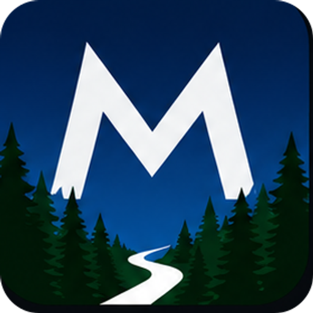
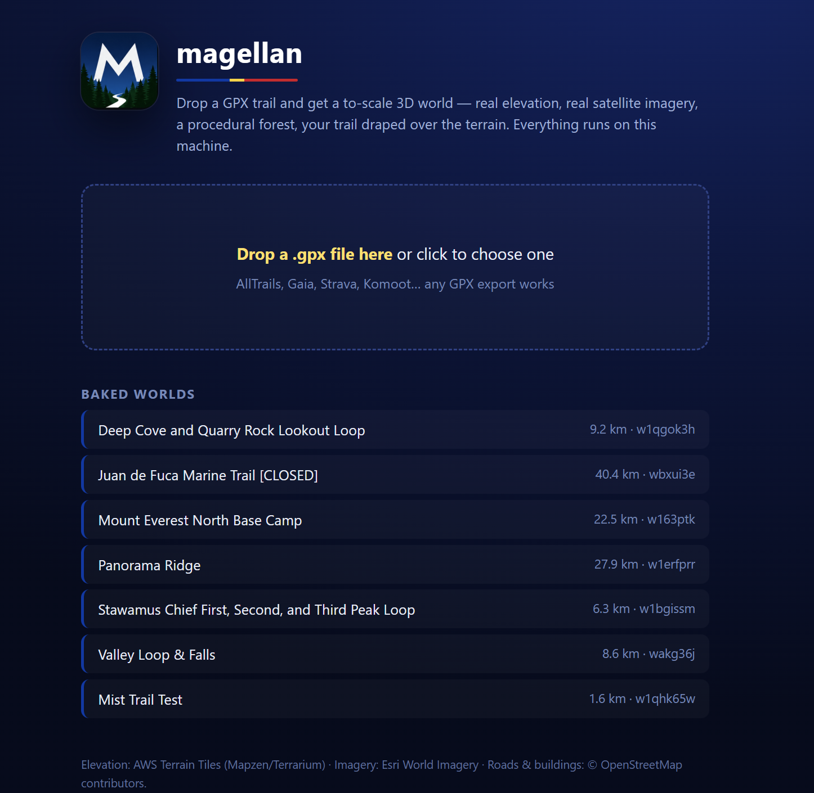
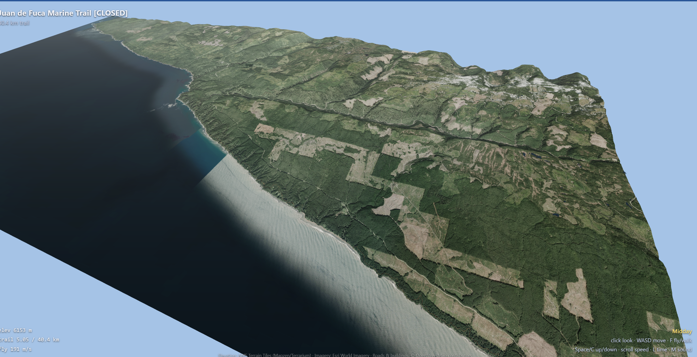
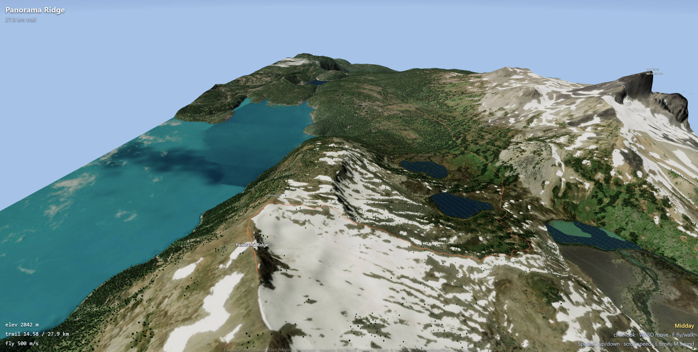
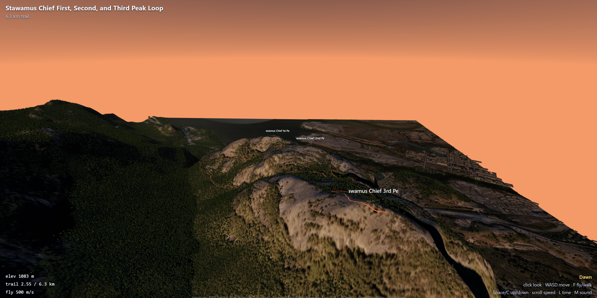

<p align="center">
  
</p>

# magellan

<p align="center">
  <a href="magellan_demo.mp4">
    
  </a>
  <br />
  <a href="magellan_demo.mp4">Watch the demo video (MP4)</a>
</p>

Turn any GPX trail into a to-scale 3D world you can fly and walk through —
real elevation, real satellite imagery, a procedurally grown forest, and your
trail draped over the terrain. Upload a track from AllTrails, Gaia, Strava,
Komoot, or anywhere else, and explore the route and the land around it.

Runs entirely on your machine. No API keys, no cloud, no account.

Named for the circumnavigator; the UI wears the colors of the Philippine flag,
where his voyage ended. Inspired by
[ode-to-yosemite](https://github.com/shlokkhemani/ode-to-yosemite),
generalized from one fixed valley to any uploaded trail.

---

## Sample worlds

| Juan de Fuca | Panorama Ridge | The Chief |
| ------------ | -------------- | --------- |
|  |  |  |

---

## How it works

You give it a GPX file. It works out the region around the trail, downloads the
real elevation and satellite imagery for that area, grows a forest where the
imagery shows trees, lays your trail onto the terrain, and bakes it all into a
dataset the browser renders in 3D. You spawn at the trailhead and roam freely.

The download-and-bake step takes anywhere from a few seconds to a couple of
minutes depending on how large the trail is — then exploring is instant.

---

## Install

Requires Node 20+.

```sh
git clone <your-repo-url> magellan
cd magellan
npm install
```

---

## Usage

### With the upload box (recommended)

```sh
npm run dev        # starts the local server, prints a localhost URL
```

Open the URL, drag a `.gpx` file onto the upload box, and wait for the world to
build. When it's done you'll drop straight into the trail in 3D.

### From the command line

Bake a world without the browser, then open it:

```sh
node lib/bake.mjs path/to/trail.gpx     # prints a worldId when finished
npm run dev                             # then open /explore/<worldId>
```

### Inspect a trail before baking

See exactly what a GPX would download — area, tile counts, trail length — before
committing to a full bake:

```sh
node lib/gpx-bounds.mjs path/to/trail.gpx
```

### Look at your own output

A headless harness drives the renderer, screenshots fixed viewpoints
(spawn, overhead, mid-trail at golden hour, night) into `shots/`, and fails
on console errors:

```sh
npm i -D playwright && npx playwright install chromium   # once
npm run verify [worldId]
```

---

## Getting a GPX

magellan never talks to AllTrails (or any trail provider) directly — you bring
the file. Export a route as GPX from your own account:

- **AllTrails** (Plus/Peak): open a route → More / Download Route → GPX Track.
- **Gaia GPS, Strava, Komoot, Caltopo**: all export GPX.
- **OpenStreetMap** hiking relations, or any GPX a friend shares.

Drop the resulting `.gpx` into the upload box.

---

## Controls

| Input     | Action                                                   |
| --------- | -------------------------------------------------------- |
| Click     | capture mouse (Esc to release)                           |
| Mouse     | look                                                     |
| W A S D   | move                                                     |
| Space / C | up / down (fly mode)                                     |
| Shift     | boost / run                                              |
| Scroll    | adjust fly speed                                         |
| F         | toggle fly ↔ walk (walk = eye height, clamped to ground) |
| L or 1–5  | time of day, dawn → night                                |
| M         | sound on / off                                           |

---

## What gets built

Each baked world lives in `worlds/<worldId>/`:

- `heights.bin` — the elevation grid for the region (decoded real DEM data).
- `imagery/` — stitched satellite texture chunks.
- `forest.png` — where the trees go, classified from the imagery.
- `osm.json` — water, roads, buildings, and points of interest near the trail.
- `trail.json` — your route, draped onto the terrain.
- `manifest.json` — how it all fits together.

Raw map tiles are cached under `cache/` and reused, so baking a second trail near
a place you've already visited is much faster. Both folders are gitignored.

---

## Data sources & attribution

magellan composites open data. If you share screenshots or recordings, credit:

- **Elevation** — AWS Terrain Tiles (Mapzen / Terrarium), derived from NASA/USGS DEMs.
- **Imagery** — Esri World Imagery.
- **Roads, buildings, water** — © OpenStreetMap contributors.

---

## Limits & notes

- **Local use only.** The free Esri imagery endpoint is fine for exploring on
  your own machine but is **not** licensed for redistribution. Don't host this
  publicly without swapping to a licensed imagery source (NAIP, Sentinel-2, or a
  paid tile plan).
- **Trail size is capped.** Very large GPX files (a box bigger than ~50×50 km)
  are rejected so a bake can't run away with your disk and bandwidth. Split a
  long thru-hike into segments, or raise the cap if you mean it.
- **Looks vary by place.** Dramatic terrain with crisp imagery is stunning; a
  flat, forested trail renders correctly but plainer. That's the underlying data,
  not a bug.

---

## Project layout

See `design.md` for the full architecture, data formats, coordinate frame, and
build plan, and `todo.md` for what's next. The short version: `lib/` is the
offline bake pipeline, `src/` is the browser renderer, `server.mjs` glues them
with an upload endpoint.
